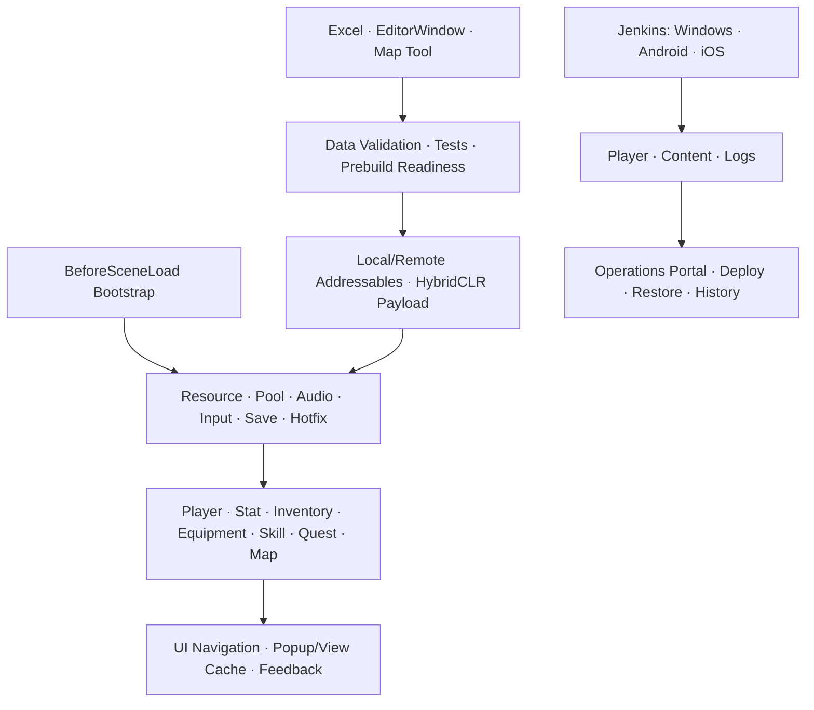

# TinyHero

> **기술 포트폴리오 제출용 공개 저장소**  
> 실제 개발·빌드용 비공개 저장소에서 라이선스 에셋, 내부 문서와 로컬 운영 데이터를 제외하고, 직접 구현한 클라이언트·툴·CI/CD 코드를 검토할 수 있도록 정제한 별도 저장소입니다.

Unity 6.3 LTS와 2D URP로 개발한 멀티플랫폼 2D 플랫포머 RPG 개인 프로젝트입니다.

플레이어 전투와 콘텐츠 구현에 그치지 않고, **[데이터 제작 → 검증 → Addressables → Jenkins 빌드 파이프라인 → 운영 툴을 통한 배포·관리]**까지의 과정을 하나의 흐름으로 연결한 프로젝트입니다.

## 30초 요약

| 구분 | 내용 |
| --- | --- |
| 프로젝트 | TinyHero · 개인 프로젝트 · 2026.06 ~ 진행 중 |
| 핵심 플레이 | 이동, 전투, 스킬, 퀘스트, NPC, 인벤토리·장비·상점, 맵 전환 |
| 설계 초점 | 데이터와 런타임 상태 분리, 책임별 매니저, 계약 기반 확장, 실패 조기 탐지 |
| 콘텐츠 전달 | Addressables Local/Remote, 필수 데이터 검증, HybridCLR Hotfix 계약 |
| 제작 환경 | Excel/NPOI Import, 데이터 EditorWindow, 런타임 맵 제작 도구 |
| 품질 근거 | 현재 소스 기준 51개 EditMode 테스트, 46개 Editor 메뉴 명령, 통합 데이터·Prebuild 검증 |
| 빌드·운영 | Jenkins Windows/Android/iOS Pipeline, ASP.NET Core Operations Portal |

## Technical Highlights

### 1. Player · Combat · Skill

**목표:** 기능이 늘어나도 플레이어 한 클래스와 중앙 분기문이 비대해지지 않는 게임플레이 구조

- 플레이어 상태와 스탯, 인벤토리, 장비, 스킬을 책임별 매니저로 분리했습니다.
- 스킬 정의와 런타임 상태를 분리하고 `Action`, `Effect`, `Unlock Condition`을 다형적으로 조합합니다.
- 스킬 VFX, 몬스터, 월드 드랍, 데미지 폰트와 토스트 메시지는 역할별 Object Pool에서 재사용합니다.
- 각 도메인이 자신의 Snapshot 생성과 복원을 담당해 저장 시스템의 직접 필드 의존을 줄였습니다.

### 2. Data-driven Content · Runtime Map Tool

**목표:** 코드 수정 없이 콘텐츠를 제작하고, 잘못된 데이터를 런타임 이전에 발견하는 파이프라인

- Excel/NPOI 데이터를 Import Profile과 Worksheet 기준으로 런타임 Table Asset으로 변환합니다.
- 퀘스트, NPC, 아이템, 상점, 스킬과 텍스트를 ScriptableObject 정의와 플레이어별 상태로 분리했습니다.
- PlayMode 맵 제작 도구에서 Map ID, 배경, BGM, 경계, 포탈, 몬스터와 NPC 배치를 편집하고 저장·불러오기합니다.
- `CUINavigationController`가 Popup/View 생성, 캐시, 표시 순서와 닫기 정책을 통합합니다.

### 3. Addressables · Hotfix · Save Security

**목표:** 배포 후 콘텐츠 갱신 경로를 확보하면서 실패와 데이터 변조를 조용히 숨기지 않는 런타임 정책

- `CResourceManager`가 Addressables 로딩, 캐시와 핸들 수명주기를 단일 진입점에서 관리합니다.
- 원격 Catalog 확인 → 사용자 다운로드 승인 → 의존성 다운로드 → 필수 데이터 검증 후 게임에 진입합니다.
- 필수 콘텐츠 검증이 실패하면 제한 횟수만큼 재시도하고, 최종 실패 시 게임 진입을 차단합니다.
- 저장 Snapshot은 AES로 암호화하고 HMAC-SHA256으로 무결성을 검증합니다.
- 핵심 런타임 수치는 `CSecureInt`, `CSecureLong`, `CSecureFloat`으로 변조를 감지합니다.
- HybridCLR는 `IHotfixModule` 계약과 `SUCCESS / FALLBACK / BLOCKED / FAILED` 정책으로 변경 가능한 규칙을 분리합니다.

### 4. Editor Tooling · Validation · Tests

**목표:** 반복 제작을 표준화하고 오류 발견 시점을 PlayMode와 Player Build 이전으로 이동

- Item, Quest, Shop, Skill, Equipment, Reward, NPC, Monster와 Map 편집기를 구현했습니다.
- EditorWindow UX를 Browser → Create → Editor → Actions → Status 흐름으로 공통화했습니다.
- 통합 검증 도구가 ID 중복, 누락 참조, 값 범위와 Addressables Key 오류를 탐지합니다.
- 저장 보호, Secure Number, Inventory, Skill, Remote Policy, Hotfix, Addressables와 VFX Pool을 EditMode 테스트로 검증합니다.
- 46개 Editor 메뉴 명령과 Prebuild Readiness 검사로 수동 반복 작업을 자동화했습니다.

### 5. Multiplatform CI/CD · Operations Portal

**목표:** 플랫폼별 빌드와 콘텐츠 업데이트를 동일한 진입점에서 실행하고 결과를 추적 가능한 형태로 보관

- Jenkins가 `PLAYER_BUILD / CONTENT_UPDATE`와 플랫폼 파라미터에 따라 전용 에이전트로 분기합니다.
- Windows Player, Android APK/AAB, iOS Xcode 프로젝트와 Addressables 콘텐츠를 빌드합니다.
- ASP.NET Core 8 기반 Operations Portal에서 Jenkins 상태·Queue·최근 빌드 조회, 빌드 실행, 콘텐츠 배포·복원과 SHA-256 이력을 관리합니다.
- iOS 범위는 Xcode 프로젝트 생성까지이며, 서명 IPA와 TestFlight 배포는 Apple 서명 자산 연동 전 단계입니다.

## Architecture

## Key Design Decisions

| 문제 | 선택 | 이유와 결과 |
| --- | --- | --- |
| 정적 정의와 플레이 상태가 섞임 | ScriptableObject/Excel 정의와 런타임 상태 분리 | 원격 갱신 범위와 저장 책임이 명확해짐 |
| 로딩 API가 기능별로 분산됨 | `CResourceManager` 단일 진입점 | Addressables 정책, 캐시와 오류 처리를 통제 |
| 필수 원격 데이터 실패를 런타임에서 뒤늦게 발견 | 새 Catalog의 필수 데이터는 검증 실패 시 진입 차단 | 불완전한 콘텐츠 상태로의 진입 방지 |
| 저장과 수치 변조 가능성 | Snapshot + AES/HMAC + Secure Number | 핵심 상태의 기밀성과 무결성 보호 |
| 빌드 후 규칙 수정 경로가 없음 | Unity Adapter와 `IHotfixModule` 계약 분리 | 메인 빌드 기본 로직과 Hotfix fallback 정책을 함께 유지 |
| 제작 오류가 PlayMode에서 발견됨 | Import → Sync → Validate → Test → Build | 오류 발견 시점을 제작·빌드 단계로 앞당김 |

## Verification Scope

| 검증 | 범위 |
| --- | --- |
| EditMode Tests | 현재 소스 기준 51개 테스트 메서드: 데이터·저장·보안·Hotfix·스킬·Pool 정책 |
| Data Validation | ID 중복, 누락 참조, 값 범위, Addressables Key |
| Save & Security | AES/HMAC, Secure Number |
| Runtime Policy | Remote Content, Hotfix fallback, Skill/Inventory, VFX Pool |
| Build Readiness | IL2CPP, HybridCLR, Content State, 플랫폼 설정 |
| CI Artifacts | Windows/Android/iOS Player 또는 Xcode, Addressables, Logs |

## Tech Stack

- **Client:** C#, Unity `6000.3.15f1`, 2D URP, UGUI
- **Content:** Addressables, Remote Catalog/Content Update, HybridCLR
- **Data & Tools:** Excel/NPOI, ScriptableObject, EditorWindow
- **Security:** AES, HMAC-SHA256, Secure Number Types
- **Quality:** Unity Test Framework, Data Validation, Prebuild Readiness
- **Delivery & Ops:** Jenkins Pipeline, PowerShell, ASP.NET Core 8

## Code Guide

| 관심 영역 | 시작점 |
| --- | --- |
| Bootstrap / Resource | [`CCorePersistentManagerBootstrapper`](Assets/Scripts/Core/CCorePersistentManagerBootstrapper.cs), [`CResourceManager`](Assets/Scripts/Core/CResourceManager.cs) |
| Player / Combat | [`PlayerController`](Assets/Scripts/Player/PlayerController.cs), [`CPlayerStatManager`](Assets/Scripts/Player/CPlayerStatManager.cs), [`CSkillManager`](Assets/Scripts/Core/Skill/CSkillManager.cs) |
| Quest / Map | [`CQuestManager`](Assets/Scripts/Core/Quest/CQuestManager.cs), [`CMapManager`](Assets/Scripts/Core/Maps/CMapManager.cs), [`CMapToolRuntimeController`](Assets/Scripts/Core/Maps/CMapToolRuntimeController.cs) |
| Save / Security | [`CSaveManager`](Assets/Scripts/Core/Save/CSaveManager.cs), [`CSecureInt`](Assets/Scripts/Core/Security/CSecureInt.cs) |
| Hotfix | [`CHotfixRuntimeLoader`](Assets/Scripts/Core/Hotfix/CHotfixRuntimeLoader.cs), [`IHotfixModule`](Assets/Scripts/HotfixContracts/IHotfixModule.cs) |
| Excel / Validation | [`CExcelTableImporter`](Assets/Scripts/Editor/Data/CExcelTableImporter.cs), [`TinyHeroDataValidationWindow`](Assets/Scripts/Tools/Editor/TinyHeroDataValidationWindow.cs) |
| CI/CD / Operations | [`Jenkinsfile`](Jenkinsfile), [`OperationsPortal`](Tools/OperationsPortal) |

## Main Scenes

- `Assets/Scenes/SceneTitle.unity`: 타이틀과 원격 콘텐츠 준비
- `Assets/Scenes/SceneMap.unity`: 메인 플레이
- `Assets/Scenes/SceneMapTool.unity`: 맵 제작과 검증

## Public Repository Note

이 저장소는 기술 포트폴리오와 코드 리뷰를 위한 공개 소스입니다. Asset Store의 리소스 에셋 및 특정 라이브러리 등은 라이선스 보호를 위해 제외합니다.
