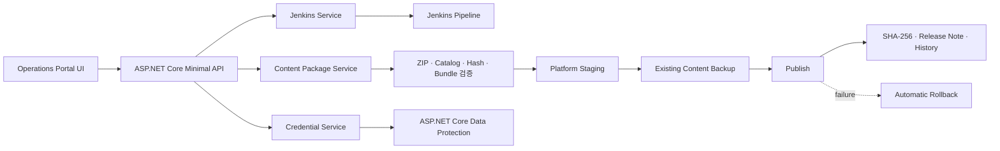

# TinyHero Operations Portal

TinyHero의 Jenkins 멀티플랫폼 빌드와 Addressables 콘텐츠 배포를 한 화면에서 관리하기 위해 구현한 ASP.NET Core 8 운영 도구입니다.

이 문서는 실행 절차보다 시스템의 책임, 데이터 흐름과 안전장치를 설명하는 포트폴리오용 기술 요약입니다.

## 목적

- 플랫폼별 Player Build와 Content Update의 실행 진입점 통합
- Jenkins Queue, 실행 중 빌드와 최근 결과의 가시성 확보
- Addressables 배포 전 검증과 실패 시 자동 롤백
- 배포 결과를 해시와 이력으로 추적

## Architecture

## 주요 기능

- `PLAYER_BUILD`, `CONTENT_UPDATE`와 플랫폼 파라미터를 Jenkins에 전달
- Jenkins 연결 상태, Queue, 실행 중 빌드, 진행률과 최근 결과 조회
- 실행 중이거나 대기 중인 빌드 취소
- Windows, Android, iOS Addressables 패키지의 플랫폼별 배포
- 배포 파일 수·용량·SHA-256·Release Note 이력 기록

## 설계 포인트

### 배포 전 검증

- ZIP 확장자와 엔트리 수·압축 해제 용량을 제한합니다.
- 정규화된 경로가 작업 디렉터리를 벗어나는지 검사해 ZIP Path Traversal을 차단합니다.
- Catalog, Hash와 Bundle 구성이 모두 확인된 패키지만 배포 대상으로 인정합니다.

### 실패 시 복구

- 새 콘텐츠는 플랫폼별 Staging 경로에서 먼저 구성합니다.
- 기존 콘텐츠를 Backup으로 이동한 뒤 Staging 결과를 배포 경로로 전환합니다.
- 전환 중 예외가 발생하면 새 경로를 제거하고 Backup을 이전 위치로 자동 복원합니다.

### 인증 정보 보호

- Jenkins 인증 정보는 환경 설정 또는 로컬 암호화 저장소에서 주입합니다.
- 로컬 저장 시 ASP.NET Core Data Protection을 사용하며 인증 데이터와 Key는 공개 저장소에 포함하지 않습니다.

### 콘텐츠 제공 정책

- Catalog와 Hash는 갱신 확인을 위해 캐시하지 않습니다.
- Bundle은 변경 불가능한 파일로 보고 장기 캐시하며 Range Request를 지원합니다.

## Code Guide

| 책임 | 시작점 |
| --- | --- |
| API와 서비스 구성 | [`Program.cs`](Program.cs) |
| Jenkins 실행·조회·취소 | [`JenkinsService.cs`](Services/JenkinsService.cs) |
| 패키지 검증·배포·롤백 | [`ContentPackageService.cs`](Services/ContentPackageService.cs) |
| 배포 이력 | [`DeploymentHistoryService.cs`](Services/DeploymentHistoryService.cs) |
| Jenkins 인증 보호 | [`JenkinsCredentialService.cs`](Services/JenkinsCredentialService.cs) |
| 대시보드 UI | [`index.html`](wwwroot/index.html), [`app.js`](wwwroot/app.js) |

## 기술 스택

ASP.NET Core 8 · Minimal API · HttpClient · Data Protection · HTML/CSS/JavaScript

## 범위

포트폴리오 환경에서 Player/Content Build와 로컬 원격 콘텐츠 배포 흐름을 검증하기 위한 도구입니다. 실제 상용 운영 환경의 사용자 권한 관리, 외부 비밀 저장소, 승인 워크플로와 관측 시스템 연동은 범위에 포함하지 않았습니다.
